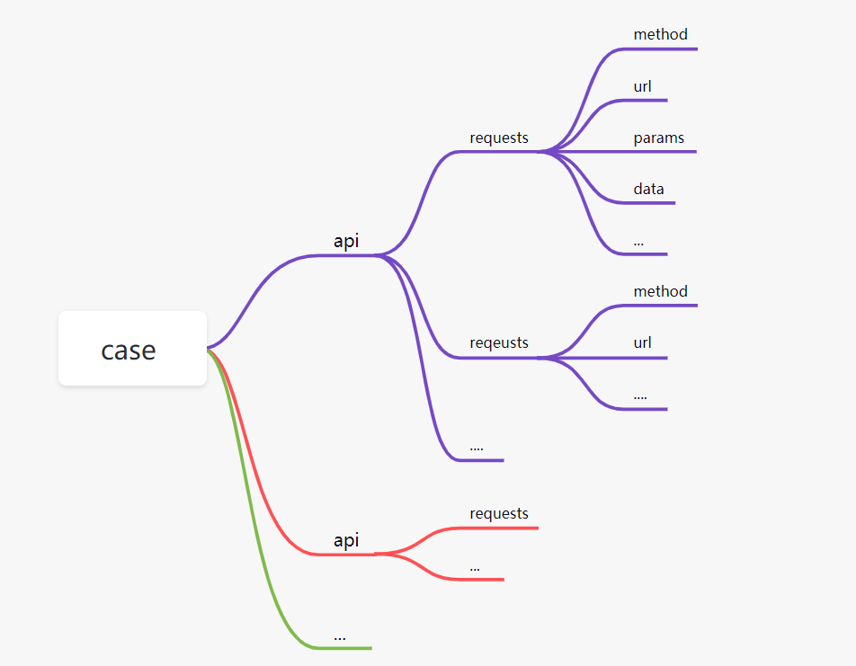

测试企业微信API https://work.weixin.qq.com/api/doc/90000/90135/90664
将借鉴 PO 思想组织用例框架，设计思路如下
```python
api
    - base_api.py   base api 用来抽象共用功能 (如数据驱动、PreparedRequest封装)
        
    - wework.py    企业微信功能性API 如 access_token 的获取
    
    - department.py  部门管理API 如:CRUD功能
    
    - ddt 
        -- step 
            {testcase_name}.step.yaml
            # 1、测试步骤数据驱动文件
            # 2、一个case其实是由多个API组成
            # 所以 yaml 文件将会这样设计：
            #     - {api: create_api}
            #     - {api: delete_api}
            #     - {assertion: xxx}
            # 具体格式参见项目yaml文件 
           {test_case_name}.api.yaml
            # 1. 每个API的数据驱动文件
            # 2. 这个的设计就比较简单了
            #   - create_api:{method:xx, data:xx, json:xx, params:xx}
            #   - delete_api:{method:xx, data:xx, json:xx, params:xx}
            # 具体格式参见项目yaml文件 
        -- data 
            {testcase_name}.data.yaml  
            # 1. 文件名将以测试用例名称来命名
            # 2. 实现方式是基于 pytest.mark 参数化来做
test_cases
    
    - test_department.py 测试部门管理的CRUD功能
    - test_wework.py  测试获取token功能

```
项目收获
```python
1、初步设计token的时候，由于过于关注逻辑上的封装，出现了过度封装的情况，导致框架从
逻辑上来讲不够紧凑。其实，没必要去为了刻意实现PO而过度的关注框架的封装，只要
保证上层业务和底层实现能彻底分离就可以，而框架层面在有的时候: Less is more。

2、这里的数据驱动其实是仿照 httprunner 实现数据驱动的思路又对其做了一些封装。

3、数据驱动，尤其是测试步骤的数据驱动，只适合固定且简单测试步骤的测试用例，并不适合
较复杂的用例逻辑，因此数据驱动和单纯PO实现的 requests 逻辑是相互辅助的，要分具体的
情景。
```
测试步骤数据驱动设计思想:

