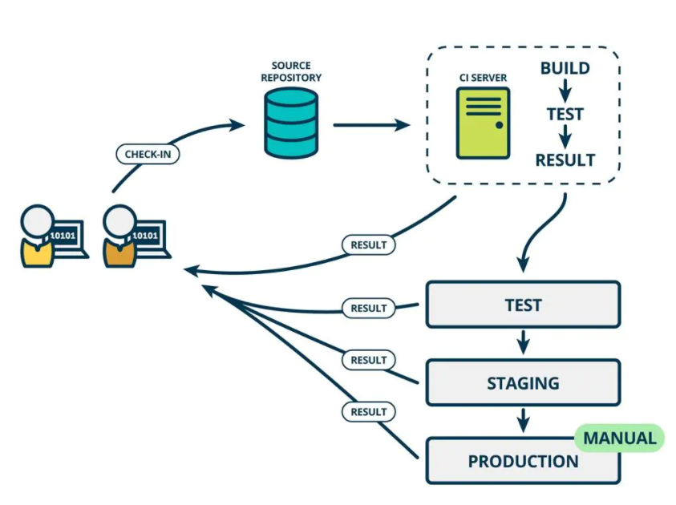
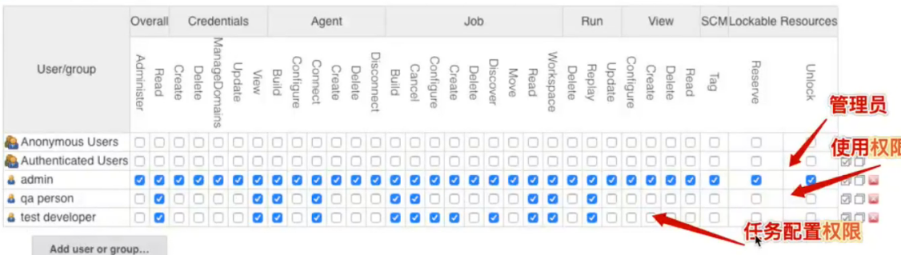

```python
持续集成(CI): 是一种软件开发实践，采用持续集成时，开发人员会定期将代码变更提交到代码仓，系统会自动运行构建和测试操作。通俗来讲，开发人员每提交一个新的功能，系统就会自动构建一个自动化测试对该功能进行验证。持续集成的好处在于能够及时并快速的发现软件质量问题，能够保证产品在快速迭代的同时也具备高质量。  
https://aws.amazon.com/cn/devops/continuous-integration/    
https://www.martinfowler.com/articles/continuousIntegration.html
```



```python
Jenkins 是一个持续集成的工具，主要用于构建自动化任务。
doc：https://www.jenkins.io/doc/book/ 
```

#### Jenkins 服务搭建

```shell
doc：https://www.jenkins.io/doc/book/installing/
linux搭建：https://www.jenkins.io/doc/book/installing/linux/
docker搭建：https://www.jenkins.io/doc/book/installing/docker/

# 镜像源
# 安装包：https://mirrors.tuna.tsinghua.edu.cn/jenkins/debian-stable/
# 安装包：https://mirrors.aliyun.com/jenkins/debian-stable/
# 插件：https://mirrors.aliyun.com/jenkins/updates/update-center.json

# docker安装注意点：
# 1、docker:dind (docker in docker) Jenkins为了在Jenkins容器中使用docker命令
# 2、通过dockerfile定制了一个配置了docker仓库和blue ocean插件的Jenkins镜像
```

#### Jenkins 简单使用

```shell
# =========================环境准备(linux、war file)==============================
代码仓方面：git 插件一般会默认安装，只需要在linux host上生成ssh key，对应配置 jenkins Credentials
python项目：最好生成下 requirements.txt 文件
# =========================jenkins启动和更新插件源==================================
1、启动jenkins：java -jar jenkins.war --httpPort=8010
2、先安装推荐插件
3、更新插件镜像源头为国内源
   mange jenkis --> manage plugins --> advanced --> Update Site
# =========================freestyle job 配置(pytest+email+allure)===================
1、入口：new item --> freestyle project
2、一个简单job配置如下：
General：
	Discard old builds 设置废弃旧构建项目策略，包括保持几天的构建，保持最大的构建个数等。可根据需要配置【主要目的是减少
	磁盘空间占用】
	
Source Code Management：
	Git 设置好git的repo、Credentials、构建的分支等【ssh with private key】

Build Triggers：
	Poll SCM：可以根据设定的时间去轮询代码库，如果有更新就执行构建
	此外 GitHub hook trigger for GITScm polling：可以通过 hook的方式触发构建，不过这个得要求github和jenkins能互相通信。如果jenkins服务是在内网搭建的话，可能会比较困难，酌情考虑。相关配置方式请google。

Build：
	add build step 选择对应的执行shell
	# 注意shell所在的工作路径是jenkins workspace的路径(源码根目录)
	# 示例：python 单元测试项目的shell编写
    if [ -d allure ];then rm -rf allure;fi
    if [ -d allure-report ];then rm -rf allure-repor;fi

    pytest -v --alluredir ./allure ./test_unit || true   # 这里是为了让用例失败的时候，构建也能往后进行(不建议这么做)

    if [ -f allure-report.zip ];then rm -f allure-report.zip;fi
    zip -r allure-report.zip ./allure-report
    
    # WORKSPACE是jenkins的内置变量，当前的job的工作目录  shell下方有个连接可以查看各种内置变量
只需这样一个简单的jenkins job就构建起来了。
```

#### Jenkins 生成Allure测试报告和邮件报警

```shell
# =========================集成 Allure 测试报告==================================
1、mange jenkis --> manage plugins 安装插件 Allure
2、Manage Jenkins --> Global Tool Configuration --> Allure Commandline 设置下name：allure, 版本选择最新即可
3、回到job配置中(my view) Build-->execute shell添加报告生成命令 如：pytest --alluredir ${WORKSPACE}/allure
4、Post-build Actions 选择 allure report 告诉下jenkins生成的allure report的路径就可以了，如上方示例的 allure
   # 注意jenkins会自动执行 allure generate -c -o 命令，可以看下 test job 的console

# =========================邮件报警===========================================
mange jenkis --> system config
1、System Admin e-mail address：配置发件人的邮件地址
2、E-mail Notification --> advanced 填写相关的信息 如下方：  # 注意此步骤可以用来测试下是否可以正常收发邮件
'''
SMTP server:  smtp.126.com
Default user e-mail suffix:  @126.com
Use SMTP Authentication
用户名：发件邮箱
密码： # 注意这个是授权码	
SMTP Port: 465
Charset：UTF-8	
'''
3、配置 Extended E-mail Notification， 如果没有需安装下  Extended E-mail 插件
	a、点击 advanced 按照 2 步骤配置下smtp server等信息
	b、Default Content Type: HTML # 这个根据需求来
	c、Default Recipients：收件人，多个收件人用，隔开
	d、Default Subject：主题 如：【自动化构建通知】$PROJECT_NAME - Build # $BUILD_NUMBER - $BUILD_STATUS!
	e、Default Content：邮件正文 相关模板可以去网上找：https://www.cnblogs.com/wintest/p/12209751.html
	然后根据需求自定制下，比如直接把allure测试报告地址放上
4、job config --> Post-build Actions 选择 editable email notifition
	 重新设置收件人，邮件主题，内容之类...
	 Attachments: allure-report.zip  # allure 的测试报告
	 advanced setting --> Triggers 设置邮箱发送的触发条件 # 具体触发条件看场景，如可以这样设置 Triggers
	 # 第一次失败，第二次失败，fixed

# 如果未收到邮件 	
1、安装插件后jenkins最好重启下
2、Allow sending to unregistered users 注意勾选下 或者让收件人注册下jenkins
3、密码错了
# 问题记录：
1、https://stackoverflow.com/questions/14392349/dont-fail-jenkins-build-if-execute-shell-fails
但是这样整个构建会被标记成 unstable，所以在测试用例失败后的要执行的操作不要写在 shell里，最好集成在代码里。
```

#### Jenkins 节点管理和用户权限配置

```shell
# =========================节点管理=========================================
jenkins是通过master-slave的方式进行任务的分布式执行
master：部署完整的jenkins服务，管理slave，分发job给slave node 执行
slave：只需要部署相应的任务环境，去执行job
# 如何配置：
1、在jenkins master上注册 slave node
mange jenkins --> manage nodes and clouds --> new node
Permanent Agent: 节点的agent类型，默认选择这个就可以
# of executors: node可并发job的数量，一般是cpu支持的线程数
Remote root directory： node的工作目录，将来job的代码(workspace)就会被拉到这个目录下
Labels: node 标签，后期跑job就可以根据这个标签来指定那个节点跑
Usage：有两种，一种是让jenkins自动分发任务，一种是指定标签跑任务
Launch method：如果node是linux系统的话，推荐launch via ssh   # 就是 master 和节点之间的连接方式
    Credentials:选择用户名和密码的方式
    Host Key Verification Strategy：not verify
# 如果node是windows 选择 Launch agent by connecting it to the master 然后根据网页提示进行操作。

2、构建job，job中指定运行的node
job config --> General--> Restrict where this project can be run 指定要运行的node

# 注意以上实践是在本机上开node操作，如果是远程node的话注意在相应的机器上配置好环境
参考：https://www.cnblogs.com/yickel/p/12206838.html

# =========================用户权限=========================================
1、启用 Role-based Authorization Strategy
manage jenkins --> config global security
Security Realm：如果团队规模比较小，不要开启运行注册，减少维护成本
Authorization：Role-based Authorization Strategy 需要安装同名插件，基于角色的权限策略
2、创建 Glabal roles 和 Project roles
manage jenkins --> Manage and Assign Roles
Global roles: 全局角色权限 (先配置)
Item roles: 项目角色权限
示例：
	先创建三个全局角色 admin、SE、QA

3、assign role 给用户分配角色
    先创建用户
    然后 assign role
    
# 参考：https://www.cnblogs.com/FLY_DREAM/p/14270083.html
# 关于不同角色的权限配置可找资料深入了解
```



#### Jenkins 多任务关联运行

```shell
job config --> Build Triggers --> Build after other projects are built
a、Trigger only if build is stable	 :success
b、Trigger even if the build is unstable	:unstable
c、Trigger even if the build fails :fail

# 场景：一些需要环境部署的项目可以单独起一个job来部署环境，然后在执行测试任务
```

#### Jenkins API

````shell
Jenkins API：jenkins的restful API
获取去官网找doc : https://www.jenkins.io/zh/
https://pythonhosted.org/jenkinsapi/
https://python-jenkins.readthedocs.io/en/latest/

# 场景：需要在代码中集成jenkins的项目，如自动化平台的开发
````

#### Jenkins Pipeline

```shell
# 写在前面！如果是比较复杂的项目，请使用Jenkinsflie来构建Pipline job 而不是 web ui的形式，减少维护成本
doc：https://www.jenkins.io/doc/book/pipeline/
以上示例都是 jenkins freestyle风格的job(ui界面配置)，如何用脚本的形式如何构建一个jenkins任务
# 构建一个Pipeline 项目
 1、Blue Ocean ui构建 # 见下下方
 2、jenkins 经典ui构建 # 只需要项目选择 pipline 风格即可
 3、Jenkinsfile构建 # 见下方
# Pipeline 概念
    pipeline block: Declarative 关键部分
    node block: Scripted 关键部分
    stage block: 工作流程阶段，building, testing, deploying
    Step block: 执行步骤
```

#### Jenkinsfile 

```shell
Jenkinsfile定义Pipeline语法的脚本，一般会把Jenkinsfile放在项目源码中(也是官方推荐的)
doc：https://www.jenkins.io/doc/book/pipeline/jenkinsfile/
# Pipeline 语法有两种：Declarative & Scripted Pipeline syntax
# ============================== Declarative ===============================
基本框架 
pipeline {
    agent {
        label 'node-2'
    }
    stages {
        stage('pull') {
            steps {
               sh 'echo pull test case'
            }
        }
        stage('run') {
            steps {
                sh 'echo run'     # !可以使用Jenkins语法生成器协助实现具体的某些操作。
            }
        }
        stage('report') {
            steps {
                sh 'echo report'
            }
        }
        
    }
}
# ============================== 如何使用 ==================================
https://www.jenkins.io/doc/book/pipeline/getting-started/#defining-a-pipeline-in-scm
1、项目根目录下创建一个 Jenkinsfile 脚本文件
2、config pipline的时候 Pipeline --> 选择 Pipline script from scm 填写下仓库的信息然后build就可
```

#### Blue Ocean

```shell
doc：https://www.jenkins.io/zh/doc/book/blueocean/getting-started/
感觉 blue ocean ui 是为了 Pipeline 而生的，其实个人感觉 classic ui 也挺好的，看习惯了...
```


