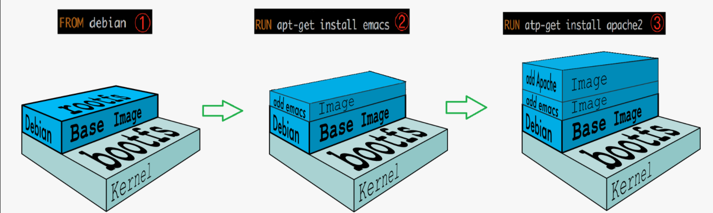
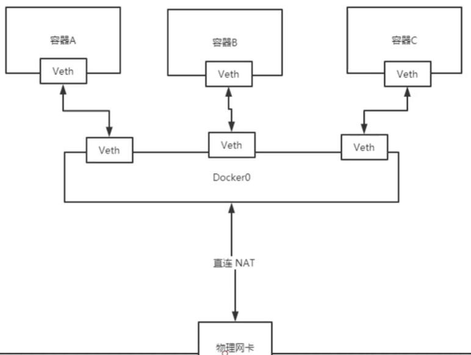

docker 是 Linux 容器技术的一种封装，也可以简单理解为是一种轻量级的虚拟机。与传统的虚拟机架构相比，docker不虚拟内核

而是直接使用宿主机的内核，因此具有启动快，占用资源少的优点。它主要的是通过 **Linux 名称空间**来实现多个docker 容器之间

网络，进程，以及文件目录等之间的隔离，使用**cgroups** 来实现资源(CPU, MEM, IO)等之间的隔离，**联合文件系统**去定制镜像文件

系统。

#### docker 安装

- 安装 
  - https://docs.docker.com/engine/install/ubuntu/
- 加速器配置
  - https://blog.csdn.net/dsl59741/article/details/107876795

#### docker 常用命令

```shell
官方文档： https://docs.docker.com/reference/
docker version
docker info
docker ${command} --help
```

##### 1、镜像命令

```shell
# 1. docker镜像和容器的区别
docker image 可以简单理解为一个携带配置和环境的应用安装包，而 docker container是镜像包运行后的实例，是一个进程(具有独立的网络，进程空间，目录即一个简化版的虚拟机)，一个镜像可以起多个容器示例，类似于面向对象中的类和对象的关系
# 2. 镜像相关的命令
docker images # 查看镜像，-a：显示所有的镜像，-q：只显示镜像id
docker search # 搜索镜像，更建议去https://hub.docker.com/搜索
docker pull # 拉取镜像 默认是拉取latest，如果要指定版本，docker pull mysql:5.7
docker rmi -f # 删除镜像
```

##### 2、容器命令

```shell
docker ps # 查看容器  默认是查看正在运行的容器， -a：正在运行的容器+历史运行过的容器 
		  # -q：只显示容器的id
docker rm  -f 容器id (容器name)  # docker ps -aq | xargs docker rm -f

docker start id/name 
docker restart id/name
docker stop id/name
docker kill id/name

docker run 
	# 注意run的流程，会先从本地找镜像，有的话直接执行，没有去仓库拉取镜像并执行
	# --name 给容器命名
	# -d 后台运行
	# -p 端口映射 主机端口:容器端口
	# -v mount 文件挂载 主机目录:容器目录
	# -e 设置环境变量

docker top # 查看容器中的进程
docker logs -f --tail 20 id/name # 查看容器日志
docker inspect  # 查看容器元数据
docker exec -it 容器id bash # 进入容器，新开起一个终端
docker attach 容器id  # 进入容器，进入正在执行的终端
docker cp 容器id:容器路径 host路径	# 从容器中拷贝文件到主机
```

#### docker 镜像

##### 1、commit镜像

> 什么是docker镜像？

简单来说docker镜像是由一层一层的文件系统组成的。比如pull镜像的时候一层一层的下载，build镜像的时候也是一层一层的构建。而这种层级的文件系统被称作联合文件系统。联合文件系统支持把对文件系统的修改作为一次提交来一层一层的叠加。比如在ubuntu容器中执行 apt install vim 等操作，可以通过 docker commit 操作，就可以定制一个携带 vim命令的 unbuntu 镜像。并且如果某层的镜像已经存在，会直接复用该层镜像，而不是再去重新下载或者构建。

docker 镜像的组成，往往会有一个 base image (rootfs: 定义Linux基础目录和命令)，多为各大发行版本，然后在往上一层一层的叠加，最后形成我们的应用镜像。



> commit 镜像

```shell
使用 docker commit 将对容器层的修改提交成镜像

docker commit -m "message" -a "xx<yy@gmail.com>"  container  repo:tag

示例：修改官方 tomcat 镜像并 commit
  docker exec -it test_tomcat bash   # 进入容器
  cp -r webapps.dist/*  webapps      # 在容器中执行某些操作
  # 将操作后的容器打包一个新镜像
  docker commit -m 'modify_tomcat' -a 'emuyi<xx@qq.com>' test_tomcat emuyi/mytomcat  
```

##### 2、Dockerflie制作镜像

Dockerfile 用来制作镜像，是一个具有构建指令的脚本文件。

> Dockerfile 指令

```shell

# 制作镜像关键在于dockerfile脚本编写，多看官网示例和开源项目的编写方式，然后根据场景多编写。
# practices: https://docs.docker.com/develop/develop-images/dockerfile_best-practices/
# doc：https://docs.docker.com/engine/reference/builder/

FROM              # 基础镜像 base image 如：ubuntu
MAINTAINER        # 维护者 xx<yy@qq.com>
ENV               # 构建的时候设置环境变量 "键 值"
RUN               # 构建的时候执行的命令 如：apt-get update   apt-get install -y vim 
WORKDIR           # 镜像的工作目录
EXPOSE            # 镜像监听的端口
ADD               # 将文件copy到镜像中，如果是压缩包会自动解压
COPY              # 类似 ADD
VOLUME            # 挂载的目录
CMD               # 容器启动的时候要执行的命令 ["/bin/bash"]
ENTRYPOIT         # 类似CMD，但它命令可追加，CMD的话是直接被覆盖
# CMD 和 ENTRYPOIT 区别
# CMD  ["ls" "l"]  进入容器后执行 -a 会报错没有 -a 这个命令，也就是说 -a 将ls -l 给完全覆盖
# ENTYRPOIT ["ls" "l"] 进入容器后执行 -a 就会在原来命令基础上进行追加 即ls -al
示例：
    FROM ubuntu
    MAINTAINER emuyi<xx@qq.com>
    # ENV set env, key value structure
    ENV work_path /usr/local/
    WORKDIR $work_path

    RUN apt-get update
    RUN apt-get install -y vim
    RUN apt-get install -y curl

    # EXPOSE listening port
    # EXPOSE 8080
    
    # CMD 容器运行的时候会执行
    CMD ["/bin/bash"]
```

> docker build 进行构建

```shell
# 注意！docker build 构建不仅需要dockerfile, 还需要一个 context，这个context 常用 . 即当前工作目录
docker build -f dockerfile path  -t repo:tag . 
# 并且通过 docker history image 查看构建历史

# 构建流程：由上至下，每一步都是一层
Step 1/10 : FROM ubuntu
 ---> f643c72bc252
Step 2/10 : MAINTAINER emuyi<xx@qq.com>
 ---> Using cache
 ---> 10aca3d82c83
Step 3/10 : ENV work_path /usr/local/
 ---> Using cache
 ---> 7d0b0bd06a62
Step 4/10 : WORKDIR $work_path
 ---> Using cache
 ---> eaec15d39cc1
Step 5/10 : RUN apt-get update
 ---> Running in 84426076f5f7
.....
Step 8/10 : CMD echo $work_path
 ---> Running in bef2e02dc716
Removing intermediate container bef2e02dc716
 ---> 9e2346ada786
Step 9/10 : CMD echo "----ok---"
 ---> Running in e18d7d1a9259
Removing intermediate container e18d7d1a9259
 ---> 7a9698358972
Step 10/10 : CMD ["/bin/bash"]
 ---> Running in 669cc1c738f7
Removing intermediate container 669cc1c738f7

```

##### 3、发布镜像

```shell
1. 发布到dockerhub
	docker login
	docker push 
2. 发布到阿里云仓库
	控制台-->容器镜像服务-->上面有详细的doc
```

#### docker 数据卷

```shell
# docker进行目录挂载目的是为了持久化容器数据和进行同步性的操作
# 目录挂载主要分为两种方式：
# 1. docker run -v 手动挂载 2. dockerfile 制作镜像的时候进行挂载
# -------------docker run 手动挂载---------------
# docker run -v host目录：container目录
docker run --name test -v /usr/local/test/:/usr/local/ ubuntu
通过：docker inspect test 查看元数据

"Mounts": [
{
"Type": "bind",
"Source": "/usr/local/test",  # host 目录
"Destination": "/usr/local",  # container 目录
"Mode": "",
"RW": true,
"Propagation": "rprivate"

# 具名挂载
docker run --name known -v know:/usr/local/ ubuntu
"Mounts": [
{
"Type": "volume",
"Name": "known",
"Source": "/var/lib/docker/volumes/known/_data",  # host 
"Destination": "/usr/local",  # container
"Driver": "local",
"Mode": "z",
"RW": true,
"Propagation": ""
}

# 匿名挂载
docker run --name unknown -v /usr/local/ ubuntu
"Mounts": [
{
"Type": "volume",
"Name": "a51d732cbb2c260ae60ea969849b935376663a5049e05046313f4231835a31ff",
"Source": "/var/lib/docker/volumes/a51d732cbb2c260ae60ea969849b935376663a5049e05046313f4231835a31ff/_data",
"Destination": "/usr/local",
"Driver": "local",
"Mode": "",
"RW": true,
"Propagation": ""
}
# 具名挂载和匿名挂载，不用指定host挂载的目录，会挂载到host的/var/lib/docker/volumes/xxxx
# ------------------使用dockerfile 进行挂载-------------------

dockerfile：
	
FROM ubuntu
ENV path /usr/local/
WORKDIR $path
VOLUME ["/usr/local", "/data"]
CMD ["/bin/bash"]

inspect 检视容器元数据：！！说明了dockerfile挂载使用匿名挂载
"Mounts": [
{
"Type": "volume",
"Name": "b83c718aabb00147322c7db5267fde530f43f8f366858688712906055184d0e2",
"Source": "/var/lib/docker/volumes/b83c718aabb00147322c7db5267fde530f43f8f366858688712906055184d0e2/_data",
"Destination": "/data",
"Driver": "local",
"Mode": "",
"RW": true,
"Propagation": ""
},
{
"Type": "volume",
"Name": "689571aa92e5f56b4798a1002bcb3ad6ecdbb81a837018ec4a8589108db807f0",
"Source": "/var/lib/docker/volumes/689571aa92e5f56b4798a1002bcb3ad6ecdbb81a837018ec4a8589108db807f0/_data",
"Destination": "/usr/local",
"Driver": "local",
"Mode": "",
"RW": true,
"Propagation": ""
}

# -------------容器间数据共享---------------
# 容器之间进行数据同步和共享 --volumes-from 参数
 docker run --name test -it --volumes-from buildvolume  ubuntu
# -------------数据卷容器---------------
# 可以将一个容器专门用来做数据共享和数据持久化，这个容器甚至都可以不用启动，所有需要数据共享的容器都可以
# 使用 --volumes-from 与数据卷容器进行绑定，比如说一些通用的配置文件，资源之类的都可以放在数据全容器上
```

#### docker 网络

> docker0 bridge 模式（默认)

```shell
docker 默认情况下使用的是 docker0 网桥 + veth-pair技术来实现容器与容器还是有host之间网络的联通。
# veth-pair 是一对的虚拟设备接口，和 tap/tun 设备不同的是，它都是成对出现的。一端连着协议栈，一端彼此相连着(通过在 host 和 container里面执行 ip addr 可以查看)
```



```shell
# 1、docker0 网桥
3: docker0:
    inet 172.17.0.1/16 brd 172.17.255.255 scope global docker0

# 172.17.0.1/16  每启动一个container, docker 都会给这个容器分配一个ip，ip 都在172.17.*这个网段中
# 所以从理论上来讲每个容器都是可以互相ping通的 如下面
docker exec -it test01 ping 172.17.0.3
docker exec -it test02 ping 172.17.0.2
# 所以单从ip通信上来说，host和容器之间，容器和容器之间都是可以ping通的。
但是使用这种方式通信，只能是基于ip通信，不能通过容器名通信。
root@emuyi:~# docker exec -it test01 ping test02
ping: test02: Name or service not known
如果容器挂掉又新起了一个，ip就变了，所以这种方式肯定不行。

# 容器互联
# 2、--link 打通容器间通过容器名进行通信
docker run --name test03 --link test02 -it ubuntu

docker exec -it test03 ping test02
root@emuyi:~# docker exec -it test03 ping test02
PING test02 (172.17.0.3) 56(84) bytes of data.
64 bytes from test02 (172.17.0.3): icmp_seq=1 ttl=64 time=0.067 ms

root@emuyi:~# docker exec -it test02 ping test03
ping: test03: Name or service not known
反向是ping不通的，如果要反ping，需要test02 --link test03

# --link 的本质其实是将 link的容器添加到了自己的/etc/hosts 文件里
172.17.0.3      test02 c0d14b59535a

# 综上：通过docker0网桥容器之间基于ip可以通信，使用 --link参数也可以实现基于容器名进行通信
# 但是 --link的话不能反ping，多个容器互联的话，配置起来很麻烦
```

> 自定义网络

```shell
# 网桥的话不使用 docker0 而是使用本地路由
# 其实定义的时候不需要加参数，docker会自动分配(网桥和ip段)
docker network create --driver bridge  --subnet 192.168.0.0/16 --gateway 192.168.0.1 mynet

docker network ls # 可以查看所有的docker网络
NAME      DRIVER    SCOPE
bridge    bridge    local
host      host      local
mynet     bridge    local

# 如何使用自定义网络： docker run的时候指定 --net 参数
docker run --name test05 -it --net mynet ubuntu
# 这样容器之间正ping和反ping都可以，docker都帮我们维护好了。
```

> 不同集群(不同的网段)之间进行网络互通

```shell
# 假如说 redis 集群和 mysql集群进行通信，如何实现？
# 方案：打通容器和对方网桥之间的通信
docker network connect mynet test01
# 本质上是将 test01 容器放在自己的网络下
docker network inspect mynet
Containers": {
			....
            "1cf84e80b2a398df6f9dca70ebf1ff6e7ced6ff2563de830d94fdab856e5b3f0": {
                "Name": "test01",
                "EndpointID": 
                "IPv4Address": "192.168.0.4/16",
                "IPv6Address": ""
            },
            .....
        }
```

#### docker compose

```shell
doc：https://docs.docker.com/compose/
docker compose 是基于yaml配置文件来定义和运行多个容器的应用。
使用 docker compose 只需要三步：
1、定义 Dockerfile 镜像构建文件
2、定义 docker-compose.yml 文件
3、一条命令： docker-compose up 直接运行
# 1. 安装 docker compose
https://docs.docker.com/compose/install/
# 2. 体验 docker compose
https://docs.docker.com/compose/gettingstarted/
最后形成的目录结构：
    -rw-r--r-- 1 root root 514 Jan 30 19:06 app.py          # 程序和依赖
    -rw-r--r-- 1 root root  12 Jan 30 19:06 requirements.txt

    -rw-r--r-- 1 root root 111 Jan 30 19:09 docker-compose.yml   # docker-compose.yml
    -rw-r--r-- 1 root root 252 Jan 30 19:08 Dockerfile  # Dockerfile
至于如何使用 docker-compose 命令 使用 --help 进行查看
# 3. 如何定义 docker-compose.yml
docker-compose.yml
总的来说就三层：
	version:
	service:
	其他配置：
如何熟练编写 docker-compose.yml？看doc，看开源项目yaml，多编写
doc：https://docs.docker.com/compose/
示例：https://docs.docker.com/compose/compose-file/
# 实例：部署selenium grid  selenium-docker https://github.com/SeleniumHQ/docker-selenium
# 实例：部署 testlink 测试用例管理平台 https://hub.docker.com/r/bitnami/testlink
version: '2'
services:
  mariadb:
    image: 'docker.io/bitnami/mariadb:10.3-debian-10'
    environment:
      - ALLOW_EMPTY_PASSWORD=yes
      - MARIADB_USER=bn_testlink
      - MARIADB_DATABASE=bitnami_testlink
    volumes:
      - '/root/mariadb:/usr/local/mariadb'  # 指定持久化的目录
  testlink:
    image: 'docker.io/bitnami/testlink:1-debian-10'
    ports:
      - '8010:8080'  # host：container
      - '443:8443'
    environment:
      - TESTLINK_DATABASE_HOST=mariadb
      - TESTLINK_DATABASE_PORT_NUMBER=3306
      - TESTLINK_DATABASE_USER=bn_testlink
      - TESTLINK_DATABASE_NAME=bitnami_testlink
      - ALLOW_EMPTY_PASSWORD=yes
    volumes:
      - '/root/testlink:/usr/local/testlink'
    depends_on:
      - mariadb   
# 实例：部署 stf 云测平台 https://github.com/DeviceFarmer/stf#requirements
# ！！！如果要是使用 docker swarm做集群，那就得需要docker stack做容器编排
```

#### docker swarm（k8s）

```shell
TODOLIST:  Golang k8s prom + grafana
```


